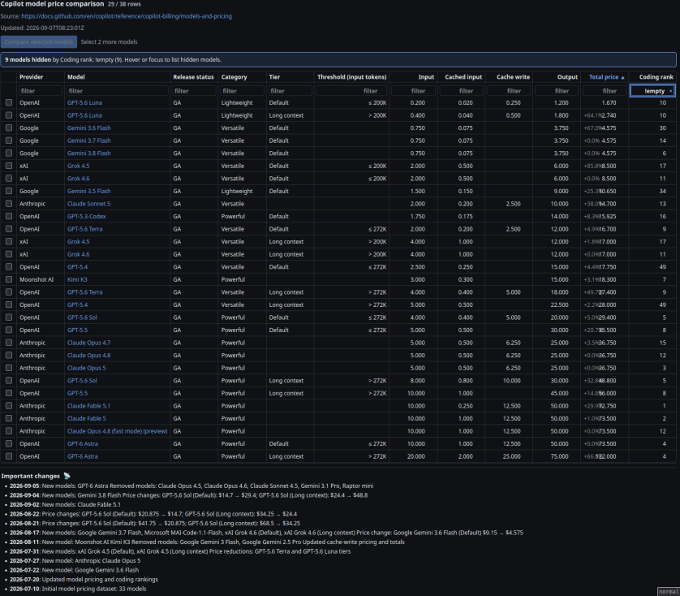

# Github Copilot Model Price Comparison

## Screenshots

[](../data/screenshot.png)

## Project overview

This repository is a dependency-free static GitHub Pages site. The UI, styles, and client-side behavior live in `index.html`; it loads the generated `data/models.json` file at runtime and renders a sortable, filterable pricing table with two-model comparison links to BenchLM.

`scripts/update_models.py` is the data pipeline. It fetches the GitHub Copilot pricing documentation and the BenchLM coding leaderboard, extracts pricing tables from the documentation's `__NEXT_DATA__` payload, normalizes rows, calculates `Total price`, matches coding ranks, and writes the JSON consumed by the site. The script uses only the Python standard library.

`.github/workflows/pages.yml` packages and deploys the repository root to GitHub Pages on pushes to `main`, on a weekly Monday schedule, and via manual dispatch. Scheduled and manual runs refresh `data/models.json`, commit it when it changes, and then deploy the site.

## Commands

The `justfile` is the canonical command entry point:

```sh
# Serve the site locally at http://127.0.0.1:8000 with browser auto-reload
just serve

# Refresh data/models.json from the external sources
just update

# Refresh data, then serve the site locally
just serve-updated
```

`just serve` watches the repository files and reloads connected local browser tabs
when the site or generated data changes. The auto-reload endpoint is only enabled
for local development and is not used by the deployed GitHub Pages site.

There is no configured build step, package manager, linter, or automated test suite. The site must be served over HTTP because `index.html` fetches `data/models.json`; opening the HTML file directly will not exercise the normal runtime path.

## Architecture and data flow

- `index.html` fetches `data/models.json` with `cache: "no-store"`, initializes client-side state, and rebuilds the table DOM after sorting, filtering, or selection changes.
- The JSON payload contains `source_url`, `leaderboard_url`, an ordered `columns` array, and `rows`. Each row has display columns plus the internal `_coding_model` and `_category_scores` fields used for coding-rank tooltips.
- `update_models.py` treats the external GitHub documentation as the pricing source and BenchLM as the coding-ranking source. Model matching first tries normalized exact names, then a normalized base-name match after removing suffixes such as `fastmode`, `preview`, `adaptive`, `high`, `max`, `reasoning`, and `thinking`.
- The updater preserves a stable preferred column order, adds any new source columns in sorted order, normalizes whitespace, computes `Total price` by summing the four price fields, and sorts rows deterministically before writing formatted JSON.
- The Pages workflow deploys the repository root directly; there is no bundling or generated frontend build directory.

## Repository-specific conventions

- Treat `data/models.json` as generated output. Change `scripts/update_models.py` or the source-processing logic, then run `just update`; do not hand-edit individual generated rows.
- Keep the JSON schema compatible with the frontend. If pricing columns or row metadata change, update both the updater's `PREFERRED_COLUMNS`/normalization logic and the corresponding frontend special cases such as `priceColumns`, threshold sorting, model links, and coding-rank tooltips.
- The frontend intentionally has no framework or external runtime dependency. Keep behavior in the existing inline JavaScript and preserve the current state-driven `renderTable()` flow unless a larger change clearly requires otherwise.
- Table behavior is deliberately client-side: default sorting is ascending `Total price`, the default filter keeps rows with a non-empty `Coding rank`, text filters use substring matching, numeric filters accept operators such as `<10` and `>=5`, and exactly two selected models enable comparison. When filters hide rows, the UI shows a hoverable notice listing the hidden models and active filter reasons.
- Model identity in the UI is the composite `${Provider}::${Model}::${Tier}::${Threshold (input tokens)}` value. Preserve all four components when changing selection or comparison behavior so similarly named pricing tiers remain distinct.
- User-visible cell content is escaped before insertion into HTML. Preserve this boundary when adding rendered values, and keep external links using `target="_blank"` with an appropriate `rel` attribute.
- The Python updater fails explicitly when the expected `__NEXT_DATA__` or rendered pricing tables are missing. Preserve these explicit errors rather than silently producing an empty or success-shaped data file.
- Keep source URLs and user-agent behavior in the updater aligned with the external data sources; changes to either source may require updating parsing or model-matching assumptions.
